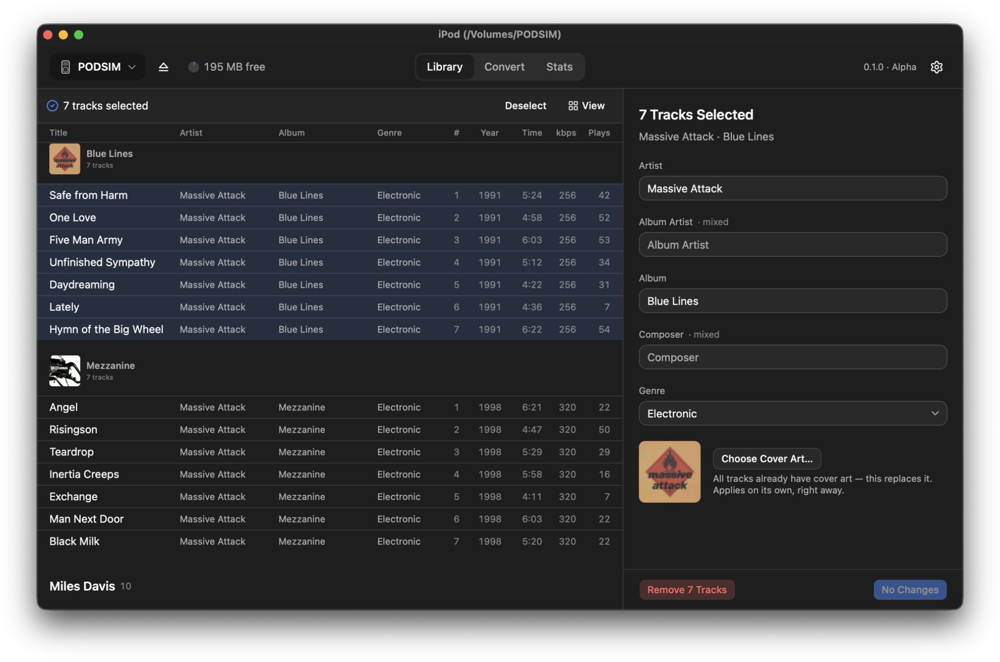

<div align="center">

  

  <h1>Platter</h1>

  <p><b>iPod without iTunes — a native macOS app that manages your library.</b></p>

<p>
  
  
  
  
</p>

  <p>
    <a href="https://github.com/kolebayev/platter/releases/latest/download/Platter_macOS_arm64.dmg">
      
    </a>
  </p>

  <p>
    <a href="#installation"><b>Install guide</b></a>
    &nbsp;·&nbsp;
    <a href="#build-from-source">Build from source</a>
    &nbsp;·&nbsp;
    <a href="#requirements">Requirements</a>
  </p>

  <br/>

  

</div>

## Features

### Your music, the way you left it

- Plug the iPod in and everything on it shows up — grouped by artist, album or
  genre, cover art and all
- Search as you type
- Scrolls smoothly whether you have 80 tracks or 80,000
- See how much space is free before and after you add anything

### Fix the messy tags

- Click a track and edit it, or select a whole album — or a whole artist — and
  fix the artist, album, composer or genre for all of them at once
- Add or replace cover art for anything you've selected
- Albums missing artwork are counted right on their header, so you can see what
  still needs a cover

### Add music

- Drag files or folders anywhere onto the window
- Or point Platter at an external drive and it'll tell you how much it would
  add before it copies a thing
- MP3 and AAC go straight on. FLAC, WAV, AIFF, APE, WavPack, DSD and `.cue`
  albums are converted for you, tags and artwork included
- Big imports notify you when they're done, so you can go do something else

### Convert on its own

- A converter you can use by itself — put the result on the iPod or in a
  folder, see the size before you commit, watch it work

### See what you actually listened to

- Lifetime plays, hours listened and top albums, taken from the iPod's own
  counts
- A heatmap of your listening year, and a share card you can copy as an image

### Make it yours

- Light, dark or match the system
- Pick a different Dock icon
- ⌘1 / ⌘2 / ⌘3 switch tabs, ⌘, opens Settings

## Installation

[**Download the latest DMG**](https://github.com/kolebayev/platter/releases/latest/download/Platter_macOS_arm64.dmg)
— Apple Silicon, macOS 14+. Older versions and the changelog are on the
[releases page](https://github.com/kolebayev/platter/releases).
Between releases, every push to `main` leaves a build under **Artifacts** on
its [CI run](https://github.com/kolebayev/platter/actions/workflows/ci.yml) —
same recipe, downloadable with a GitHub account. Or
[build from source](#build-from-source).

1. Open the `.dmg` and drag Platter to Applications

2. Run this once in Terminal:

   ```sh
   xattr -dr com.apple.quarantine /Applications/Platter.app
   ```

   Builds are ad-hoc signed rather than notarized, so without this macOS
   refuses to open the app — "Apple could not verify Platter is free of
   malware". The command clears the download flag; you only need it once.

3. Open Platter and connect your iPod

4. Click **Open Privacy Settings** when prompted and enable Platter under
   **Privacy & Security → Files & Folders → Removable Volumes**, then relaunch

## Build from source

### Prerequisites

- Rust (rustup) and Node 20+
- libgpod at `~/.local` (override with `LIBGPOD_PREFIX`) — not in Homebrew,
  build it from source; GLib chain from Homebrew (override with `BREW_PREFIX`).
  Its `configure` trips on two things a Mac with Homebrew has: it needs the
  perl carrying `XML::Parser` (macOS's `/usr/bin/perl`, not Homebrew's), and it
  asks pkg-config for `libplist` where Homebrew's module is `libplist-2.0`.
  `.github/workflows/build-dmg.yml` carries the working incantation for both
- `brew install dylibbundler` for self-contained bundles
- ffmpeg/ffprobe staged as sidecars: `tauri-src/binaries/` is gitignored, so a
  fresh clone must run `./scripts/stage-ffmpeg.sh` before its first build or
  `tauri build` fails on `externalBin`

### Develop

```sh
npm install
./scripts/stage-ffmpeg.sh     # once per clone; see the release caveat below
npm run tauri dev
```

### Tests

```sh
npm test              # Vitest over ui/lib
cargo test --manifest-path tauri-src/Cargo.toml   # includes the FFI ABI mirror test
```

### Distribute

```sh
npm run bundle        # tauri build, then scripts/bundle-dylibs.sh
```

`npm run tauri build` alone produces an app that **only runs on this
machine** — it still links libgpod from `~/.local` and GLib from Homebrew.
`bundle-dylibs.sh` copies those into `Contents/Frameworks`, rewrites install
names, re-signs, and packs a versioned `Platter_<version>_<arch>.dmg` with a
drag-to-`/Applications` layout. It exits non-zero if any shipped binary still
references a build-machine path, is missing a bundled dependency, or requires
a newer macOS than `tauri.conf.json` promises.

What stands between a local build and a public release:

- **ffmpeg licensing.** `stage-ffmpeg.sh` stages Homebrew's ffmpeg only with
  `ALLOW_GPL_FFMPEG=1` — a development-only escape hatch; that build is GPLv3
  and cannot ship under this repo's LICENSE. Build the LGPL configuration
  first — `.github/workflows/release.yml` carries the full configure line and
  builds it on every tagged release
- **Deployment targets.** Dylibs built on this machine floor at this machine's
  macOS. Rebuild dependencies with `MACOSX_DEPLOYMENT_TARGET=14.0`, or
  `bundle-dylibs.sh` refuses the bundle (`ALLOW_MINOS_MISMATCH=1` overrides
  for local-only builds)
- **Signing.** Set `SIGN_IDENTITY="Developer ID Application: …"` for
  `npm run bundle`, then notarize:
  `xcrun notarytool submit <dmg> --keychain-profile <profile> --wait` and
  `xcrun stapler staple Platter.app`

### Simulated iPod (PODSIM)

Development doesn't need a real Classic on the desk.
`~/VirtualPods/PodSim.dmg` is a read-write MS-DOS image seeded with a real
library through the app's own C bridge — 81 tracks, 6 artists, 13 albums,
cover art included:

```sh
hdiutil attach ~/VirtualPods/PodSim.dmg   # mounts /Volumes/PODSIM
```

It appears in Platter's disk list exactly like a real Classic. Requirements
learned the hard way: the image must be `UDRW` (compressed images mount
read-only), `iPod_Control/{Music/F00..F19,iTunes,Artwork}` must pre-exist
(libgpod 0.8.3 doesn't create them), and `iPod_Control/Device/SysInfo` needs a
real `ModelNumStr` (e.g. MB565) or artwork is silently not written. Re-seed
with `cargo run --example seed_podsim` (`--enrich` backfills plays and
bitrates, `--covers` replaces art in place).

## Requirements

- macOS 14 or later, Apple Silicon (no Intel build)
- An iPod Classic in disk mode
- Not supported: iPhone / iPod Touch and 3rd/4th-generation Shuffle

## Privacy

Everything happens between your Mac and your iPod. Platter makes no network
requests, collects nothing, and phones nowhere — the app's content security
policy doesn't even permit a remote connection.

## License

Platter is source-available and proprietary — see [LICENSE](LICENSE). It
bundles LGPL components (libgpod, the GLib chain, and — in release builds — an
LGPL ffmpeg); their licenses and the relinking rights they grant are described
in [THIRD-PARTY-NOTICES.md](THIRD-PARTY-NOTICES.md) and shipped inside the
app.

---

<div align="center">

**Ilia Kolebaev**

</div>
